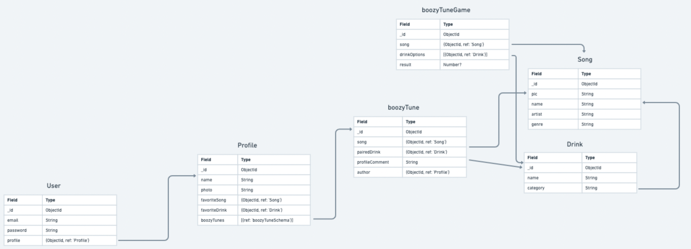
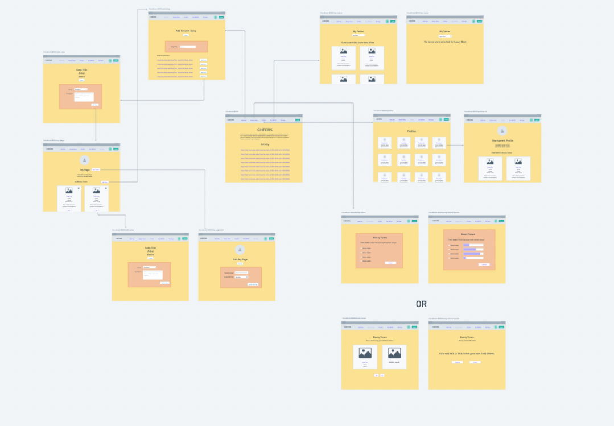
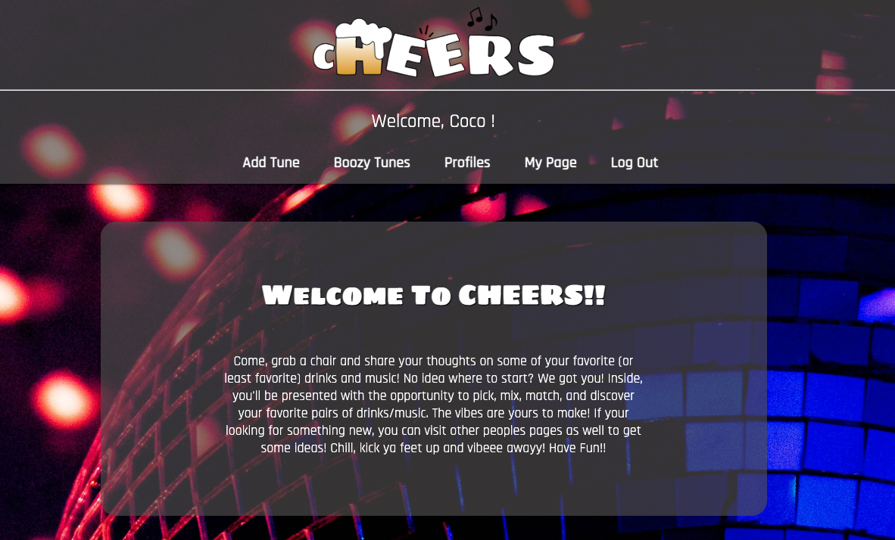

# CHEERS!🍻 🎶
[Click here to get to the Deployed Link](https://cheers-ga.netlify.app)

## Getting Started  
CHEERS is where you can pair songs with drinks! There are four sections:
- Add Tune (add your favorite tunes and pair it with your favorite drink)
- Boozy Tunes (random pairing are shown here and you can add it to your profile)
- Profiles (view other profiles and their favorite pairings)
- My Page (view your own page details and have the ability to edit, add, delete your boozy tunes)

Users are able to:
- create, edit, and delete boozy tunes
- edit their profile
- add their favorite drink and song
- view other profiles and their boozy tunes

## Github

[Click here to get to the Back-End Github](https://github.com/Recipra/cheers-back-end)

## Planning  

[Click here to get a closer look at our Trello Planning Materials](https://trello.com/b/rgQGmaqS/cheers)

### ERD & Wireframe
#### [Click here to get a closer look to the ERD and Wireframe](https://whimsical.com/cheers-McPc4UySsYLgaNQAbJjUeZ)

### Website Preview

# SCREEN SHOT OF WEBSITE HERE

## Technologies Used:
  
  
  
  
  
  
  
  

## API Used:

## Next Steps
- [ ] 'My Tastes' page where users can see their songs by their drink choices
- [ ] Users can display/hide which playlists they want to share
- [ ] Users can preview each song
- [ ] Users can recommend a song to another user
- [ ] Mobile friendly

## Contributors
- Jonathan Olivencia [Click here view github](https://github.com/Recipra)
- Coco Kim [Click here view github](https://github.com/imcocokim)
- Dahlia Lobera [Click here view github](https://github.com/dlobera)
- Savienne Mitchell [Click here view github](https://github.com/Savienne)

## Special Thanks
- Hunter Long (MVP!)
- Emily Lascano
- Jackson Reeves
- David Stinson
- Ben Manley
- Ian Terada
- Joe Malatesta
